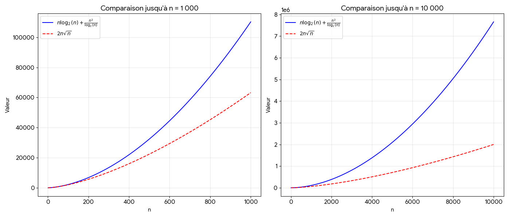
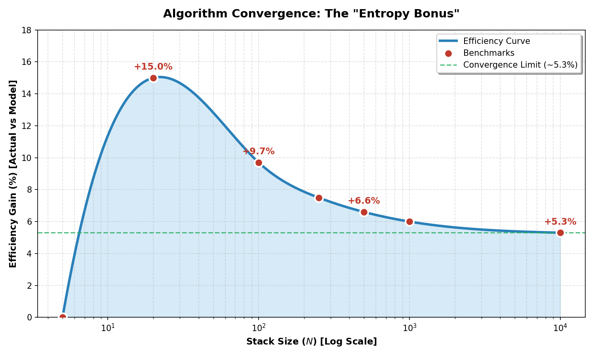

<!-- *********************************************************************** -->
<!--                                                                         -->
<!--                                                      :::      ::::::::  -->
<!-- README.md                                          :+:      :+:    :+:  -->
<!--                                                  +:+ +:+         +:+    -->
<!-- By: arebilla <arebilla@student.42lyon.fr>      +#+  +:+       +#+       -->
<!--                                              +#+#+#+#+#+   +#+          -->
<!-- Created: 2026/01/14 08:47:35 by arebilla          #+#    #+#            -->
<!-- Updated: 2026/01/14 08:55:26 by arebilla         ###   ########.fr      -->
<!--                                                                         -->
<!-- *********************************************************************** -->

*This project has been created as part of the 42 curriculum by [ abounoua, arebilla ].*

# Push_swap

## Description

**push_swap** is a performance-oriented algorithmic project that requires sorting a stack of integers under strict constraints. The primary challenge lies in achieving a sorted state using a restricted instruction set while minimizing the total number of operations.

The system operates with two stacks:
* **Stack A**: Initially contains a set of unsorted, unique integers.
* **Stack B**: A secondary stack, initially empty.

The goal is to sort all integers in Stack A in ascending order by applying a sequence of predefined operations:
* **Swap** (`sa`, `sb`, `ss`): Exchanges the first two elements at the top of the stack.
* **Push** (`pa`, `pb`): Transfers the top element from one stack to the top of the other.
* **Rotate** (`ra`, `rb`, `rr`): Shifts all elements upward; the top element moves to the bottom.
* **Reverse Rotate** (`rra`, `rrb`, `rrr`): Shifts all elements downward; the bottom element moves to the top.

The success of the project is measured by the efficiency of the sorting algorithm, aiming for the lowest number of instructions to pass the evaluation thresholds.

## Technical Stack
* **Language:** C
* **Compiler:** `clang`
* **Build System:** Makefile

## Instructions

### Compilation
The project uses a standard **Makefile**. To build the executable, run:

```bash
make
```
To build the checker use:
```bash
make bonus
```
Available rules: `all`, `clean`, `fclean`, `re`, `test`, `norm`, `bonus`

### Usage
```
./push_swap [stack_a] [STRATEGY] [OPTIONS]

Strategies:
  --simple      Force O(n²) algorithm.
  --medium      Force O(n√n) algorithm.
  --complex     Force O(n log n) algorithm.
  --adaptive    (Default) Automatically selects strategy based on disorder.

Options:
  --bench       Benchmark mode: display stats to stderr after sorting.
                (Disorder %, strategy name, complexity, and operation counts).

Examples:
  ./push_swap "3 1 2"
  ./push_swap "100 5 42 0" --complex --bench
  ARG="4 67 3"; ./push_swap "$ARG"
```

### Checker Usage

The `checker` program reads sorting instructions from the standard input and verifies if they correctly sort the `stack_a`.

**Syntax:**
`./checker [stack_a]`

**How it works:**
* The checker waits for instructions (e.g., `sa`, `pb`, `rra`) via `stdin`.
* Once the instructions are finished (press `Ctrl+D` to send EOF), it displays:
    * **OK**: If the stack is perfectly sorted and `stack_b` is empty.
    * **KO**: If the stack remains unsorted.
    * **Error**: In case of invalid arguments or non-existent instructions.

**Examples:**

```
# Manual verification
ARG="3 1 2"; ./push_swap $ARG | ./checker $ARG

# Verification with a specific strategy and benchmark
ARG="100 5 42 0"; ./push_swap $ARG --complex | ./checker $ARG

# Using a random number generator (Linux/macOS)
ARG=$(seq 1 100 | shuf | tr '\n' ' '); ./push_swap $ARG --adaptive | ./checker $ARG
```

## Algorithms analysis

### Simple strategy: insertion sort adaptation
#### Introduction
The insertion sort algorithm adapted for two stacks (**Stack A** and **Stack B**) operates by isolating elements and reinserting them in their correct relative order. The logic follows a three-phase execution:

1.  **Initial Transfer:** Elements are moved from Stack $A$ to Stack $B$ to prepare for the sorted re-insertion.
2.  **Sorted Insertion:** The algorithm iterates through Stack $B$. For each element, it calculates the optimal number of rotations (`ra` or `rra`) required to bring the correct insertion point to the top of Stack $A$. Once the spot is ready, the element is pushed back onto Stack $A$.
3.  **Final Alignment:** After all elements are moved back to Stack $A$, a final rotation is performed to ensure the smallest element is at the top, completing the ascending sort.


#### Pseudo-code
```text
# Phase 1: Preparation
WHILE (size(Stack A) > 1):
    PUSH top of A to B (pb)

# Phase 2: Sorted insertion
WHILE (Stack B is NOT empty):
    # Determine the shortest path (rotations) 
    # to reach the correct insertion position in A
    insertion_index = get_insertion_index(stack A, top of B)
    
    ROTATE Stack A (ra or rra) based on insertion_index
    PUSH top of B to A (pa)

# Phase 3: Final Adjustment
min_index = get_min_index(Stack A)
ROTATE Stack A (ra or rra) to bring min_index to top
```

#### Cost Breakdown
| Step | Operation | Best Case | Average Case | Worst Case |
| :--- | :--- | :--- | :--- | :--- |
| **1** | Transfer $n - 1$ elements from Stack $A$ to Stack $B$ | $n - 1$ (`pb`) | $n - 1$ (`pb`) | $n - 1$ (`pb`) |
| **2** | **Loop :** While Stack $B$ is not empty | $n - 1$  | $n - 1$  | $n - 1$ |
| **2.1** | Position insertion node on top of $A$ | $0$ | $\sum_{k=2}^{n - 1} \frac{k}{4}$ (`ra` or `rra`) | $\sum_{k=2}^{n - 1} \frac{k}{2}$ (`ra` or `rra`) |
| **2.2** | Push top of $B$ onto $A$ | $n - 1$ (`pa`) | $n - 1$ (`pa`) | $n - 1$ (`pa`) |
| **3** | Finalize: Move smallest node to top of $A$ | $0$ | $\frac{n}{4}$ (`ra` or `rra`) | $\frac{n}{2}$ (`ra` or `rra`) |

#### Cost Analysis

##### Position Insertion (Step 2.1)
The cost of positioning the insertion node is cumulative as stack $B$ is emptied. In the **worst case**, the complexity is an arithmetic series that resolves as follows:

$$\text{Cost}_{2.1} = \sum_{k=2}^{n - 1} \frac{k}{2} = \frac{1}{4} (n^2 - n - 2)$$

For the **average case**, we assume the distance to the correct position is halved:

$$\text{Cost}_{2.1} = \sum_{k=2}^{n - 1} \frac{k}{4} = \frac{1}{8} (n^2 - n - 2 )$$

For the **best case**, we assume that the stack $A$ is already correctly positionned therefore there is no need to rotate the stack before proceeding to the insertion. The cost is $0$.

##### Total Cost
Given the cost of each step, the sum of the cost for each case in terms of number of operations performed is for the **worst case**:

$$\text{Total cost} = \frac{1}{4}(n^2 + 9n - 10)$$

For the **average case**:

$$\text{Total cost} = \frac{1}{8}(n^2 + 17n - 18)$$


For the **best case**:

$$\text{Total cost} = 2n - 2$$

##### Numerical estimate in number of operations performed:

| n |  Best Case | Average Case | Worst Case |
| :--- | :--- | :--- | :--- |
| **10** | $18$ | $31$ | $45$ |
| **100** | $198$ | $1460$ | $2722$ |
| **500** | $998$ | $32310$ | $63622$ |


#### Complexity Analysis

##### Time Complexity Analysis
Given the quadratic nature of the summation in Step 2.1, in order to evaluate the time complexity, we can omit the low order terms and the of the equation and the constant factors. the overall time complexity of the algorithm is:

* **Worst Case:** $O(n^2)$
* **Average Case:** $O(n^2)$
* **Best Case:** $O(n)$ (When the stacks is already sorted)

##### Space complexity

Given the requirements of the exercise, the space required to execute the algorithm is $2n$: 2 stacks of size $n$ are required to store and manipulate the data. 
* **Space complexity - *all cases*:** $O(n)$

#### Conclusion on Performance

The provided analysis demonstrates that this stack-based insertion sort is a **quadratic-time algorithm** ( $O(n^2)$ ) in both average and worst-case scenarios. Its performance is heavily dictated by the cost of rotations required to find the correct insertion index in Stack $A$.

While the algorithm is highly efficient for very small datasets (typically $n \leq 10$), the cost grows quadratically as $n$ increases. As shown in the numerical estimates, the operation count for $n=500$ exceeds 60,000, making it significantly less efficient than $O(n \log n)$ alternatives for large-scale data.

#### Optimal Use Cases

Despite its $O(n^2)$ complexity, this algorithm is optimal or highly suitable in the following contexts:

1.  **Small Data Sets:** Due to its low constant factors, it outperforms complex algorithms that require recursive calls or heavy partitioning logic when $n$ is very small.
2.  **Nearly Sorted Data:** If the input is already partially ordered, the number of rotations in the insertion step decreases significantly, moving the performance closer to the $O(n)$ best-case scenario.

### Medium strategy: Bucket sort
#### Introduction
The bucket sort algorithm adapted for two stacks operates on the following principles:
- **Normalization (indexing)**: Since Buket Sort performs best with a uniform distribution, the initial stack is analysed without performing any **stack operation**. Each value is replaced by its *rank* (its relative position from $0$ to $n - 1$). This tranforms any input into a perfectly uniform distribution of integers, while preserving their relative order.
- **Bucket partitioning**: The stack is divided into $k$ virtual buckets. For each bucket $i$ (from $0$ to $k - 1$), we identify elements within the range $\left[ i \times \frac{n}{k}, (i + 1) \times \frac{n}{k} \right)$. These elements are pushed from the primary stack to the secondary stack, effectively pre-sorting the data in descending order.
- **Final sorting**: Once the elements are partitioned, each bucket is processed individually. A **selection sort** strategy (finding the highest value within the bucket) is applied to move the elements of each bucket back to the primary stack in their final, correct order.

#### Pseudo-code
```text

# Phase 0: Indexing

# Phase 1: Distribute elements into k buckets

FOR each bucket i from 0 to k - 1
    WHILE bucket i is not full
        IF top of Stack A is within bucket i limits
            PUSH top of Stack A to Stack B
        ELSE
            ROTATE Stack A

# Stack B now contains elements grouped by bucket in descending order.
# Elements inside each bucket are unsorted.

# Phase 2: Rebuild sorted stack

WHILE Stack B is not empty
    Compute the index of the maximum element in Stack B 
    # Note: the maximum element is always part of the bucket
    # currently at the top of the stack.

    ROTATE Stack B using the shortest path (rb or rrb)
    PUSH top of Stack B to Stack A
```

As illustrated in the pseudo-code, our implementation is fundamentally structured around two distinct phases: 
1. **Partitioning phase** driven by a precise median pivot. This strategy enforces equal partition sizes, ensuring stable time performance and avoiding the $O(n^2)$ Quicksort worst-case scenario.
2. Recursive **divide-and-conquer** phase. Our implementation strategically offloads lower partitions to Stack B, leveraging the LIFO property to naturally restore order during the reassembly phase.

> **Note on Stack B Logic:** The Quicksort operation on Stack B follows the same partitioning logic but mirrors the flow: it sends unsorted elements / sorted back to Stack A. Crucially, due to the recursion stack and the LIFO nature of the data structure, the algorithm processes and pushes the larger partitions of B first. These elements land on top of the previously sorted (and larger) elements of A. As the recursion unwinds, the smallest elements are pushed last, placing them at the very top of Stack A and finalizing the ascending order.

Let us now link these phases to their respective algorithmic costs to rigorously determine the global complexity of the implementation.

#### Cost Breakdown
| Step | Operation | Best Case | Average Case | Worst Case |
| :--- | :--- | :--- | :--- | :--- |
| **1** | **Loop**: For $n$ elements, check against median and PUSH to $B$ or ROTATE $A$ | $\frac{3}{2}n$ | $\frac{3}{2}n$ | $\frac{3}{2}n$ |
| **2** | Recursively sort lower partition on $B$ and upper partition on $A$ | $\sum_{i=0}^{k - 1}{n - i \frac{n}{k}}$ (`ra` or `pb`) |
| **2** | **Loop :** While Stack $B$ is not empty | $n$  | $n$  | $n$ |
| **2.1** | Position max node on top of $B$ | $0$ | $k \cdot \sum_{i=1}^{\frac{n}{k}} \frac{i}{4}$ (`rb` or `rrb`) | $k \cdot \sum_{i=1}^{\frac{n}{k}} \frac{i}{2}$ (`rb` or `rrb`) |
| **2.2** | Push top of $B$ onto $A$ | $n$ (`pa`) | $n$ (`pa`) | $n$ (`pa`) |

#### Cost Analysis

##### Phase1: Bucket partitioning
The cost of positioning the insertion node is cumulative as stack $B$ is emptied. The cost is the same for **average case** and **worst case**:

$$\text{Cost}_{P1} = \sum_{i=0}^{k - 1}{n - i \frac{n}{k}} = n \left( \frac{k - 1}{2} \right)$$

if $k$ is considered as function of n, this phase scales as $O(nk)$.

For the **best case**, when the stack is already sorted, only a single traversal of stack $A$ is required:

$$ \text{Cost}_{P1} = n = O(n) $$

##### Phase2: Final sorting
For the **worst case** we assume that the number of rotations required to bring the maximum element to the top of the stack is equal to half of the current size of the bucket. The number of push is equal to the current size of stack $B$:

$$\text{Cost}_{P2} = n + k \cdot \sum_{i=1}^{\frac{n}{k}} \frac{i}{2} = \frac{1}{4k} n^2 + \frac{5}{4}n$$

This results in a complexity of $O(n^2/k)$.

For the **average case** we assume that the number of rotations is halved. 

$$\text{Cost}_{P2} = n + k \cdot \sum_{i=1}^{\frac{n}{k}} \frac{i}{4} = \frac{1}{8k} n^2 + \frac{9}{8}n$$

This results in a complexity of $O(n^2/k)$.

For the **best case** we assume that the stack is already sorted in descending order, therefore no rotations are performed:

$$ \text{Cost}_{P2} = n = O(n) $$

#### Optimal Sizing of Buckets ($k$)

The total complexity $T(n, k)$ is the sum of both phases. We observe a clear trade-off:

* **Large Bucket ($k \to n$):** Phase 1 complexity increases toward $O(n2)$ as the number of buckets grows, increasing the number of rotations performed in Stack $A$, while Phase 2 decreases toward $O(n)$.
* **Small Bucket Count ($k \to 1$):** Phase 1 remains near $O(n)$, but Phase 2 complexity surges toward $O(n2)$ as the algorithm reverts to a standard insertion sort behavior on a single stack.

To find the optimal k, we balance the two dominant terms:

$$n \cdot k \approx \frac{n^2}{k} \implies k^2 \approx n \implies k = \sqrt{n}$$

##### Numerical estimate in number of operations performed:

| n |  Best Case | Average Case | Worst Case |
| :--- | :--- | :--- | :--- |
| **10** | $20$ | $26$ | $31$ |
| **100** | $200$ | $687$ | $825$ |
| **500** | $1000$ | $7300$ | $8760$ |

#### Conclusion on performance
By setting the number of buckets to $\sqrt{n}$, the overall time complexity of the algorithm is optimized to $O(n\sqrt(n))$. While this does not reach the efficiency of $O(n \log n)$ algorithms, it represents a significant optimization over the $O(n2)$ baseline.

As illustrated in the figure below, using $\sqrt{n}$ buckets leads to lower asymptotic growth rate compared to  logarithmic bucket configuration. This behavior arises because, for sufficiently large input sizes, the second term of the complexity expression dominates, causing the $\sqrt{n}$-based strategy to scale more favorably than the $\log n$ alternative.




#### Optimal use case

The selection of this $O(n\sqrt{n})$ approach over $O(n^2)$ or $O(n \log n)$ algorithms depends on the interplay between the dataset size ($n$) and the relative disorder of the set:

* **Medium sized Datasets:** In scenarios where $n$ is too large for quadratic $O(n^2)$ algorithms but the overhead of $O(n \log n)$ implementations (such as complex pivot logic) is undesirable, the $O(n\sqrt{n})$ model serves as an efficient middle-ground.
* **Medium Relative Disorder:** The bucket sort is adaptabive to disorder: it performs better on low disorder sets than on high disorder sets. On low disorder sets, the complexity tends towards $O(n)$. However the phase 1 processing introduces an additional overhead over insertion sort making it less efficient on small and nearly sorted sets than insertion sort.

### Complex strategy: Quicksort

#### Introduction

**Quicksort** is a powerful **divide-and-conquer** algorithm. It works by selecting a **pivot** element and partitioning the data so that smaller elements move to one side and larger ones to the other.

Due to its exceptional practical speed and efficiency with memory, variants of Quicksort are the standard choice for sorting implementations in many major languages, including **C (`qsort`)**, **C++ (`std::sort`)**, and **Java**.

Let's breakdown more in details our two-stack adaptation for the Push_swap project.


#### Pseudo-code
```text

# Phase 0: Indexing / Pre-calc
Calculate Median

# Phase 1: Partitionning
ROTATION_COUNTER = 0
FOR each element in current partition size:
    IF element < median:
        PUSH B
    ELSE:
        ROTATE A
        ROTATION_COUNTER++

# Restoration
REPEAT ROTATION_COUNTER times:
    REVERSE ROTATE A 
    (Only if we are not at the very root/full stack size)

# Phase 2: Recursion
# 1. Sort the "Upper" half first (they stay at bottom of stack A)
QUICKSORT A (partition_size: upper_count)

# 2. Sort the "Lower" half (on B) and bring them back
QUICKSORT_AND_PUSH_A B (partition_size: lower_count)
```

As you can read, we implemented an optimized recursive **Quicksort** algorithm tailored for a dual-stack environment (Stack $A$ and Stack $B$). By utilizing a **median pivot** strategy, the algorithm guarantees a balanced recursion tree, stabilizing the complexity even in worst-case scenarios. The logic can be divided in 2 phases.

1.  **Divide (Partitioning):** The stack is split into two halves based on the exact median. Elements smaller than the median are pushed to the target stack (`pb` or `pa`), while others are rotated (`ra` or `rb`) to be preserved.
2.  **Conquer (Recursion):** The sorting process is recursively applied to the sub-partitions until the size reaches a base case ($n \le 3$).

> **Note on Stack B Logic:** The Quicksort operation on Stack B follows the same partitioning logic but mirrors the flow : it sends elements sorted in decreasing order back to Stack A. Crucially, due to the recursion stack and the LIFO nature of the data structure, the algorithm processes and pushes the larger partitions of B first. These elements land on top of the previously sorted (and larger) elements of A. As the recursion unwinds, the smallest elements are pushed last, placing them at the very top of Stack A and finalizing the ascending order.
---

#### Computational Complexity Analysis

The efficiency of the algorithm relies on the optimal selection of pivots, ensuring the recursion depth never exceeds $\log_2 n$.

##### 1. Cost Breakdown

| Step | Operation | Best Case | Average Case | Worst Case |
| :--- | :--- | :--- | :--- | :--- |
| **1** | **Partitioning (Per Level)**<br>Scan $n$ elements: PUSH half to target, ROTATE half to keep.<br>*(Includes restoration of rotated elements)* | $\frac{3}{2}n$ | $\frac{3}{2}n$ | $\frac{3}{2}n$ |
| **2** | **Recursion Depth**<br>Number of times the partitioning is repeated as stack deepens due to perfect median split. | $\log_2 n$ | $\log_2 n$ | $\log_2 n$ |
| **3** | **Base Cases**<br>Sorting small partitions ($\le 3$) at the bottom of the recursion tree. | $\approx n$ | $\approx n$ | $\approx n$ |

---

##### 2. Mathematical Proof

To rigorously determine the operation cost $T(n)$, we define the complexity as a **recurrence relation**:

$$
T(n) = \begin{cases} 
C_{base} & \text{if } n \le 3 \quad \text{(Base cases handled locally)} \\
2T\left(\frac{n}{2}\right) + \frac{3}{2}n & \text{if } n > 3 \quad \text{(Recursive partitioning)}
\end{cases}
$$

Where:
* **$a = 2, b = 2$**: The problem is strictly divided into 2 sub-problems of size $n/2$.
* **$D(n) = \frac{3}{2}n$**: The linear cost to partition includes scanning $n$ elements (1 op) and restoring the $n/2$ kept elements (0.5 op).

###### A. Asymptotic Class (Master Theorem)
We apply the **Master Theorem** comparing $f(n) = \frac{3}{2}n$ with the critical exponent $n^{\log_b a} = n^1$.
Since $f(n) = \Theta(n^1)$, we fall into **Case 2**:
$$T(n) = \Theta(n \log n)$$
This confirms the algorithm is asymptotically optimal for a comparison-based sort.

---

##### 3. Exact Cost Derivation (The "Truncated Tree" Model)

While the Master Theorem provides the asymptotic class, determining the **exact** operation count requires analyzing two specific factors: the expected cost of the leaves and the exact height of the truncated recursion tree.

###### A. Combinatorial Proof of Base Case Cost ($\frac{17}{18}n$)
The recursion stops at $n=3$. We determine the expected cost $E[C_3]$ by analyzing the symmetric group $S_3$ (all permutations of 3 elements).
Assuming a uniform distribution $P(\sigma) = \frac{1}{6}$, we trace the algorithm's operations:

| Permutation | Operations Sequence | Cost |
| :--- | :--- | :--- |
| `1 2 3` | None | 0 |
| `1 3 2` | `pb`, `sa`, `pa` | 3 |
| `2 1 3` | `sa` | 1 |
| `2 3 1` | `pb`, `sa`, `pa` + `sa` | 4 |
| `3 1 2` | `sa` + `pb`, `sa`, `pa` | 4 |
| `3 2 1` | `sa` + `pb`, `sa`, `pa` + `sa` | 5 |

**Sum of costs:** $17$
**Average cost ($E_3$):** $\frac{17}{6}$ ops.

Since the total $n$ elements are divided into $n/3$ partitions at the leaves:
$$Cost_{leaves} = \frac{n}{3} \times E_3 = \frac{n}{3} \times \frac{17}{6} = \frac{17}{18}n$$

###### B. Truncated Tree Height
The recursion does not reach $n=1$. It stops at $n=3$, effectively "pruning" the bottom of the tree.
* **Theoretical Height:** $\log_2 n$
* **Effective Height ($H_{eff}$):** The recursion depth is determined by $\frac{n}{2^H} = 3$.

* **Solving for $H_{eff}$:**

We isolate the exponential term:
$$2^{H_{eff}} = \frac{n}{3}$$

$$\log_2\left(2^{H_{eff}}\right) = \log_2\left(\frac{n}{3}\right)$$

$$H_{eff} \cdot \log_2(2) = \log_2 n - \log_2 3$$
>By applying logarithm laws ($\log(a^b) = b \cdot \log a$ and $\log(\frac{a}{b}) = \log a - \log b$)

$$H_{eff} = \log_2 n - \log_2 3$$

---

###### C. Total Cost Aggregation via Recursion Tree
To derive the global cost $T(n)$, we sum the work performed at every level of the recursion tree plus the work performed at the leaves.

1.  **Cost per Recursive Level:**
    At any depth $i$, the problem is divided into $2^i$ sub-problems of size $\frac{n}{2^i}$. Since the partitioning cost is linear ($\frac{3}{2} \times size$), the total work at level $i$ is constant:
    $$C_{level}(i) = 2^i \times \left( \frac{3}{2} \cdot \frac{n}{2^i} \right) = \frac{3}{2}n$$

2.  **Summation:**
    We sum this constant work over the height of the truncated tree ($H_{eff}$) and add the base case cost ($Cost_{leaves}$).
    $$T(n) = \left( \sum_{i=0}^{H_{eff}-1} \frac{3}{2}n \right) + Cost_{leaves}$$
    
    Since the term $\frac{3}{2}n$ is constant, the sum becomes a multiplication:
    $$T(n) = \left( \frac{3}{2}n \times H_{eff} \right) + Cost_{leaves}$$

##### 4. Final Complexity Formula

We combine the cost of the truncated partitioning phases with the cost of the base cases.

**Total Cost Equation:**
$$T(n) = \underbrace{\frac{3}{2}n \times (\log_2 n - \log_2 3)}_{\text{Truncated Partitioning}} + \underbrace{\frac{17}{18}n}_{\text{Base Cases}}$$

**Expansion and Simplification:**
$$T(n) = \frac{3}{2}n \log_2 n - \frac{3}{2}n \log_2 3 + \frac{17}{18}n$$

We factor out $n$ for the linear terms:
$$T(n) = \frac{3}{2} n \log_2 n - n \left( \frac{3}{2} \log_2 3 - \frac{17}{18} \right)$$

**Numerical Approximation:**
By evaluating the constants ($\log_2 3 \approx 1.585$):
* $\frac{3}{2} \log_2 3 \approx 2.377$
* $\frac{17}{18} \approx 0.944$
* Constant term: $2.377 - 0.944 = 1.433$

> **Approximative Operation Count:**
> $$T(n) \approx 1.5 n \log_2 n - 1.43 n$$

#### 5. Conclusion

##### A. Mathematical Summary
Through a rigorous analysis using the **Recursion Tree Method** and a combinatorial study of the symmetric group $S_3$ for base cases, we have established the precise operational cost model for this algorithm:

$$T(n) \approx 1.5 n \log_2 n - 1.43 n$$

This formula confirms that while the algorithm belongs to the standard **$\Theta(n \log n)$** complexity class (optimal for comparison-based sorting), the constant factors have been minimized. The negative linear term ($-1.43n$) mathematically demonstrates the efficiency gains achieved by the "Truncated Tree" strategy (stopping recursion at $n=3$).

##### B. Benchmarks: Theory vs. Reality
The following table confronts our three levels of analysis against actual execution averages.

| Stack Size | Complexity class<br>($n \log_2 n$) | Precise Model<br>($1.5 n \log_2 n - 1.43n$) | Actual Average<br> | Reliability<br> |
| :---: | :---: | :---: | :---: | :---: |
| **5** | $\approx 11$ | $\approx 10$ | $\approx 10$ | 0.0% |
| **20** | $\approx 86$ | $\approx 100$ | $\approx 85$ | +15.0% |
| **100** | $\approx 664$ | $\approx 853$ | $\approx 770$ | +9.7% |
| **250** | $\approx 1991$ | $\approx 2628$ | $\approx 2432$ | +7.5% |
| **500** | $\approx 4482$ | $\approx 6007$ | $\approx 5608$ | +6.6% |
| **1000** | $\approx 9965$ | $\approx 13515$ | $\approx 12710$ | +6.0% |
| **10000** | $\approx 132877$ | $\approx 184985$ | $\approx 175237$ | +5.3% |

<br>



##### C. Gap Analysis
As observed in the benchmarks, the actual algorithm consistently outperforms even our precise mathematical model (by approximately 400-500 operations for $N=500$). This positive discrepancy reveals the limits of a static probabilistic model and highlights the impact of **randomness** on practical efficiency:

1.  **Favorable Entropy (Presortedness):**
    Our model assumes a uniform distribution of permutations ($P(\sigma) = 1/6$) for the base cases ($N=3$). In practice, the partitioning process is not destructive; it often preserves or creates partial relative order. Consequently, base cases arrive "already sorted" or "nearly sorted" much more frequently than pure chance would predict, significantly dropping the cost of leaves below the expected $\frac{17}{18}n$.

2.  **The Nature of Randomness (Stochastic Variance):**
    A theoretical formula calculates a strict mathematical expectation (average cost). However, **randomness** implies variance, not maximum disorder. In many random datasets, elements naturally form clusters or sequences that are cheaper to move than the theoretical average suggests.
    While the model assumes a constant "friction" cost for every element, the algorithm dynamically capitalizes on these natural irregularities found in random distributions, effectively turning the unpredictability of input data into a performance advantage.

To conclude, this quicksort implementation provides an interesting mathematical analysis and proves that sometimes, practice doesn't just match theory it beats it !

### Adaptive Strategy

#### Introduction
Real-world data is rarely uniformly random. To maximize efficiency across all possible stack configurations, our `push_swap` implementation features an **Adaptive Mode**. Instead of forcing a single algorithm onto every dataset, the system first analyzes the "entropy" (or disorder) of the input stack and dynamically selects the most appropriate internal sorting strategy.

#### The Disorder Metric
We define the disorder of a stack $A$ as the normalized count of **inversions**. An inversion is defined as a pair of indices $(i, j)$ such that $i < j$ and $A[i] > A[j]$.

$$\text{Disorder} = \frac{\sum_{i=0}^{n-1} \sum_{j=i+1}^{n-1} \mathbb{1}_{A[i] > A[j]}}{\text{Total Pairs}}$$

Where the total number of pairs is $\frac{n(n-1)}{2}$.
This metric produces a scalar value $d \in [0, 1]$:
* **$d \approx 0$**: The stack is nearly sorted.
* **$d \approx 0.5$**: The stack is randomly distributed (high entropy).
* **$d \approx 1$**: The stack is reverse-sorted.

#### Selection Logic & Complexity Targets
Based on the calculated disorder $d$, the system routes the execution to one of three regimes. This routing ensures that the overhead of complex algorithms is avoided when the data is already structured, while asymptotic efficiency is guaranteed for chaotic data.

| Disorder Score ($d$) | Regime | Selected Algorithm | Target Complexity | Rationale |
| :---: | :---: | :---: | :---: | :--- |
| **$d < 0.2$** | **Low** | **Insertion Sort** | $O(n^2)$ | For nearly sorted data, the overhead of recursion (Quicksort) or bucket allocation is counter-productive. Insertion sort, with its low constant factors and ability to skip sorted segments, is faster in practice. |
| **$0.2 \le d < 0.5$** | **Medium** | **Bucket Sort** | $O(n\sqrt{n})$ | When partial order exists but is not dominant, Bucket Sort provides a middle-ground efficiency, avoiding the worst-case quadratic pitfalls while remaining simpler than a full recursive partition. |
| **$d \ge 0.5$** | **High** | **Quicksort** | $O(n \log n)$ | For high-entropy random stacks, only a Divide & Conquer approach can satisfy the strict operation limits. The median-pivot Quicksort ensures optimal moves regardless of the input chaos. |

## Learners Contributions

The contribution of each learner is as follows:
- *abounoua*: implementation of data structures and parsing, implementation of selection sort, bucket sort, quick sort and radix sort algorithms, analysis of complex algorithm and adaptative strategy.
- *arebilla*: implementation of Makefile, creation of unit tests, implementation of stack operations, implementation of insertion sort and merge sort algorithms, analysis of simple and medium algorithms.

## Resources

### Books
- Introduction to algorithms / Thomas H. Cormen, Charles E. Lierson, Ronald L. Rivest, Clifford Stein

### On-line resources
- [Sorting algorithm / Wikipedia](https://en.wikipedia.org/wiki/Sorting_algorithm)
- [Analysis of algorithms / Wikipedia](https://en.wikipedia.org/wiki/Analysis_of_algorithms)
- [Master Theorm / Clarence Kineider](https://perso.eleves.ens-rennes.fr/people/pierre.le-barbenchon/devinfo/masterthrm.pdf)
- [Longest Increasing Subsequence (LIS) / GeeksForGeeks](https://www.geeksforgeeks.org/dsa/longest-increasing-subsequence-dp-3/)
- [Longest Increasing Subsequence Problem Explained / ByteQuest](https://www.youtube.com/watch?v=iQP5XFeXiMQ)


### AI assistants
- Gemini 3 Flash / Gemini 3 Pro:
  - Explanation of mathematical concepts required for algorithm analysis
  - Assistance with the drafting and formatting of `README.md`
  - Support in exploring potential algorithms optimisation strategies

### Tools
- [Push Swap Visualizer / Emmanuel Ruaud](https://github.com/o-reo/push_swap_visualizer)
